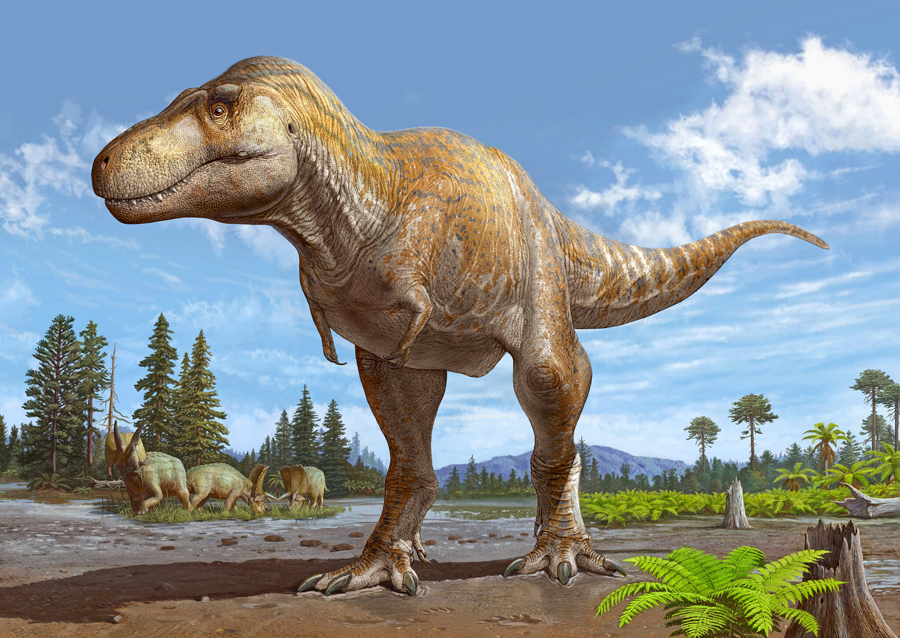

## Notable Dinosaurs
- **Tryranosaurus rex:** Often called T. rex, this powerful carnivore is famous for its massive jaws, sharp teeth, and tiny arms. It was one of the largest meat-eating dinosaurs and lived during the Late Cretaceous period.

   

- **Stegosaurus:** Recognizable by its distinctive back plates and spiked tail, Stegosaurus was a large plant-eater that lived during the Late Jurassic period.

    

  
