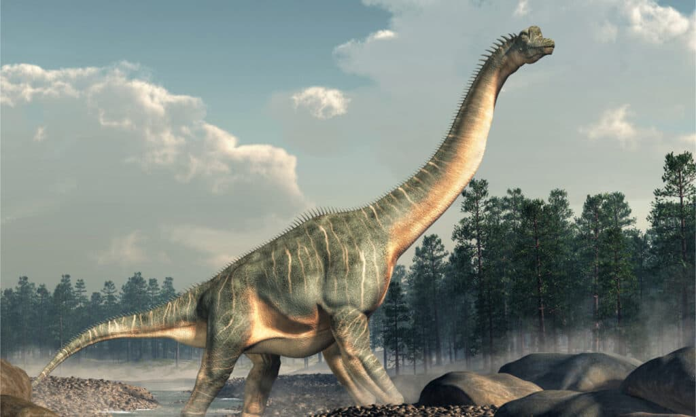

## Notable Dinosaurs
- **Tryranosaurus rex:** Often called T. rex, this powerful carnivore is famous for its massive jaws, sharp teeth, and tiny arms. It was one of the largest meat-eating dinosaurs and lived during the Late Cretaceous period.

   

- **Stegosaurus:** Recognizable by its distinctive back plates and spiked tail, Stegosaurus was a large plant-eater that lived during the Late Jurassic period.

    

- **Velociraptor:** Popularized by movies, Velociraptor was actually a smaller, feathered dinosaur that lived in packs. It was fast, intelligent, and likely hunted in groups.

     

- **Brachiosaurus:** Known for its long neck and front legs that were longer than its back legs, Brachiosaurus was a huge herbivore that could reach tall trees for food. It lived during the Late Jurassic.
  
     

- **Spinosaurus:** This unique, large dinosaur had a sail-like spine on its back and may have been semi-aquatic, hunting fish in rivers and swamps. It lived during the Cretaceous period and was even larger than T. rex.

     

