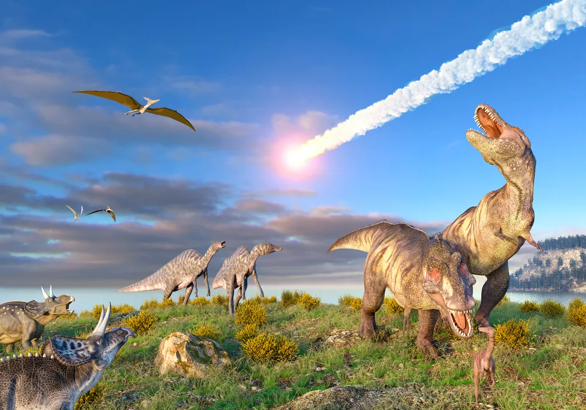

## The End of Dinosaurs

Around 66 million years ago, a massive asteroid struck Earth near what is now the Yucatán Peninsula in Mexico, creating the Chicxulub Crater. The impact sent huge amounts of dust and debris into the atmosphere, blocking sunlight and drastically cooling the planet. This sudden climate shift disrupted ecosystems and made it difficult for plants and animals to survive. Fires and tsunamis likely followed, further worsening conditions. Alongside this, volcanic activity and changing sea levels may have added to the environmental stress. As a result, about 75% of Earth's species, including the dinosaurs, went extinct, marking the end of the Mesozoic Era and paving the way for mammals to rise as the dominant life forms.

---
### Quick Links 
[Previous: Facts](facts.md) | [Next: Dinosaurs](dinosaurs.md)
